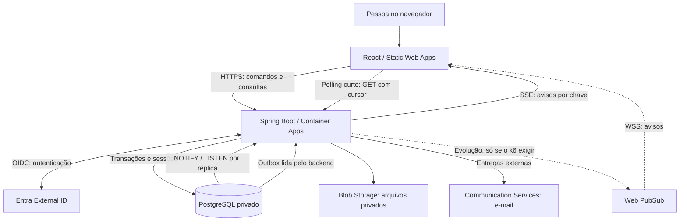

# Duora — Plano técnico inicial

**Versão 0.1 · 5 de outubro de 2026**  
**Produto:** encontros entre adultos por experiências e minijogos compartilhados.

> Proposta ajustável para uma equipe pequena e um piloto fechado. Bibliotecas, infraestrutura, limites e organização podem mudar conforme protótipos, custos e testes.

> **Atualização 2026-10-08 ([ADR 0021](adr/0021-chat-temporario-e-reconexao.md)):** o transporte de tempo real deixou de ser o Azure Web PubSub. O caminho decidido é **polling curto agora e SSE no próprio Spring (com `NOTIFY` do PostgreSQL) depois**. O Web PubSub fica como evolução, só se o teste de carga com k6 mostrar conexões ou latência que a API não sustenta. O texto original foi mantido riscado onde mudou.

**Resumo:** React + TypeScript no frontend; Java + Spring Boot em um monólito modular; PostgreSQL; Azure Container Apps; tempo real por polling curto e depois SSE no Spring (~~com Web PubSub~~, que fica como evolução condicionada ao k6; ADR 0021). Sem Kubernetes próprio ou microsserviços no início.

## 1. Frontend

Aplicação web com prioridade para celular e área administrativa. Sem app nativo, 3D ou renderização no servidor no MVP.

| Necessidade | Escolha inicial | Aplicação no Duora |
|---|---|---|
| Interface | [React 19](https://react.dev/versions) + TypeScript com `strict` | Componentes e modelos tipados. |
| Build | [Vite](https://vite.dev/guide/), [Node.js 24 LTS](https://nodejs.org/en/about/previous-releases) e [npm](https://docs.npmjs.com/cli/v11/commands/npm-ci) | Desenvolvimento, build estático e dependências com lockfile (`package-lock.json`, instalado com `npm ci`). |
| Rotas | [React Router](https://reactrouter.com/start/declarative/installation) | Cadastro, eventos, sala, conversas e administração. |
| Dados remotos | [TanStack Query](https://tanstack.com/query/latest/docs/framework/react/overview) | Consultas, cache em memória, mutações e invalidação. |
| Estado de interface | Hooks, Context e `useReducer` | Modais e apresentação do jogo; sem duplicar todo o banco em estado global. |
| Formulários | [React Hook Form + Zod](https://ui.shadcn.com/docs/forms/react-hook-form) | Perfis e inscrições; validação também no servidor. |
| Estilo e componentes | [Tailwind CSS](https://tailwindcss.com/docs/installation/using-vite) + [shadcn/ui](https://ui.shadcn.com/docs) | Componentes adaptados à identidade visual, não um tema genérico intocado. |
| Cliente HTTP | `fetch` + tipos gerados por [openapi-typescript](https://openapi-ts.dev/introduction) | Contrato compartilhado, erros e credenciais tratados em um único cliente. |
| Tempo real | `fetch` com polling curto (a cada 2 s, só com a aba visível) e depois `EventSource` (SSE) em `GET /api/me/stream`, na mesma origem do BFF ([ADR 0021](adr/0021-chat-temporario-e-reconexao.md)). ~~SDK JavaScript do [Azure Web PubSub](https://learn.microsoft.com/en-us/azure/azure-web-pubsub/overview)~~ fica como evolução, só se o k6 exigir. | Receber avisos por chave e reler o estado autorizado pela API; ações continuam passando pela API. |
| Qualidade | [oxlint](https://oxc.rs/docs/guide/usage/linter.html) e `tsc` (`typecheck`) | Lint com avisos como erro e checagem de tipos separada do build, no editor e na integração contínua. |

**Design:** Figma, tokens visuais e componentes reutilizáveis; estética adulta e lúdica. Testar teclado, foco, contraste, redução de movimento e acesso permanente a sair/denunciar. Animações CSS primeiro.

**Organização:** `src/app`, `src/features/{profile,events,room,chat,moderation}` e `src/shared`; composição de componentes e estado global apenas quando necessário.

## 2. Backend

| Necessidade | Escolha inicial | Aplicação |
|---|---|---|
| Linguagem e framework | [Java 25 + Spring Boot 4 4.x](https://docs.spring.io/spring-boot/system-requirements.html) | Base conservadora; confirmar patches e compatibilidade ao iniciar o repositório. |
| Build | Maven + Maven Wrapper | Build reproduzível; dependências alinhadas pelo gerenciamento do Spring Boot. |
| HTTP | Spring MVC, Jakarta Validation e JSON | API REST em `/api/v1`, DTOs explícitos e erros padronizados com `ProblemDetail`. |
| Persistência | Spring Data JPA, Hibernate e HikariCP | Operações transacionais e pool de conexões limitado. |
| Migrações | Flyway + SQL versionado | Evolução do banco sem `ddl-auto=update` em produção. |
| Login | Spring Security OAuth2 Client + [Microsoft Entra External ID](https://learn.microsoft.com/en-us/entra/external-id/customers/overview-customers-ciam) | Identidade gerenciada para consumidores; não construir um servidor de autenticação próprio. |
| Sessões | [Spring Session JDBC](https://docs.spring.io/spring-session/reference/configuration/jdbc.html) no PostgreSQL | Sessões compartilhadas entre réplicas e revogáveis. |
| Documentação | [springdoc-openapi 3.x](https://springdoc.org/) + OpenAPI/Swagger UI | Contrato da API; documentação administrativa com acesso restrito. |
| Operação | Actuator, logs estruturados e [OpenTelemetry/Application Insights](https://learn.microsoft.com/en-us/azure/azure-monitor/app/opentelemetry-enable) | Saúde, métricas, rastreamento e alertas sem conteúdo privado. |

Adicionar apenas os starters necessários. DTOs como `records`, conversões simples e MapStruct somente se justificar. Tempo real não exige adotar WebFlux.

**Integrações:** SDKs Azure atrás de adaptadores, com timeouts e tentativas limitadas. Cobrança futura por checkout hospedado, provedor a selecionar; sem processar cartões no Duora.

## 3. Arquitetura

### Monólito modular com fronteiras explícitas

Um backend publicável, organizado por funcionalidade. Separar regras de HTTP, persistência e fornecedores onde facilitar testes; sem quatro camadas obrigatórias para todo CRUD.

Linhas contínuas valem para o caminho decidido na [ADR 0021](adr/0021-chat-temporario-e-reconexao.md): polling no início e SSE com `NOTIFY` depois. As tracejadas (Web PubSub) são só a evolução condicionada ao k6. O aviso interno por `NOTIFY` sem passar pela outbox é uma pendência aberta com o usuário (ADR 0021, "Pendente com o usuário", item 1).

| Módulo | Responsabilidade |
|---|---|
| `identity` e `profiles` | Conta, identidade externa, perfil, preferências e elegibilidade. |
| `events` e `matching` | Inscrições, rodadas, disponibilidade e pares mutuamente elegíveis. |
| `experiences` | Catálogo versionado, regras, ações e estado das partidas. |
| `connections` e `chat` | Decisões privadas, conexão por interesse mútuo e mensagens. |
| `trustsafety` | Bloqueios, denúncias, revisão e ações de moderação. |
| `notifications` e `billing` | Convites, lembretes e pagamentos quando necessários. |

Módulos conversam por operações explícitas, não por manipulação cruzada de tabelas. Usar [Spring Modulith](https://docs.spring.io/spring-modulith/reference/) inicialmente para verificar fronteiras e ciclos.

**Fluxo de uma ação:** navegador → API valida usuário, participação e estado → transação salva a alteração → o cliente descobre a mudança por polling curto (no início) ou por aviso por chave via SSE (`NOTIFY` na transação, depois) e relê o estado pela API → reconcilia sua visualização. A outbox continua para entregas externas ou que não podem se perder (e-mail, push) e, se um dia entrar, para o Web PubSub ([ADR 0009](adr/0009-outbox-e-eventos.md), atualizada pela [ADR 0021](adr/0021-chat-temporario-e-reconexao.md)). PostgreSQL guarda a verdade; o canal de tempo real transporta avisos, não decide resultados. ~~Transação salva alteração + evento na outbox → publicador envia atualização pelo Web PubSub~~ (texto original, revisto em 2026-10-08).

**Reconexão:** recuperar estado autorizado pela API; eventos têm identificador e versão. Ignorar duplicados e buscar novamente quando houver lacunas. No chat, o cursor é a sequência da mensagem (`afterSeq`): aviso repetido, perdido ou fora de ordem leva ao mesmo `GET` de recuperação ([ADR 0021](adr/0021-chat-temporario-e-reconexao.md)).

## 4. Banco de dados

**PostgreSQL 18**, com a mesma versão principal em desenvolvimento, testes e Azure, conforme as [versões suportadas](https://learn.microsoft.com/en-us/azure/postgresql/configure-maintain/concepts-supported-versions).

**Modelo inicial:** `users`, `external_identities`, `profiles`, `preferences`, `consent_records`, `events`, `registrations`, `rounds`, `pairings`, `experience_versions`, `game_sessions`, `participants`, `actions`, `decisions`, `connections`, `messages`, `blocks`, `reports`, `moderation_actions`, `outbox_events` e tabelas de sessão de login. Criar conforme cada funcionalidade for implementada.

| Decisão de modelagem | Aplicação |
|---|---|
| Relacional primeiro | Chaves estrangeiras, restrições e unicidade; identidade externa identificada por emissor + sujeito, não pelo e-mail. |
| JSONB com propósito | Conteúdo narrativo e estado variável dos jogos; usuários, permissões e relações continuam estruturados. |
| Datas e valores | Instantes em UTC com `timestamptz`; valores monetários em centavos ou `numeric`, nunca ponto flutuante. |
| Concorrência | Versão otimista para ações do jogo; bloqueio transacional do registro coordenador ao formar pares e avaliar decisões simultâneas. |
| Unicidade | Uma inscrição por evento/pessoa; uma decisão por sessão/pessoa; uma conexão por par normalizado. |
| Consultas | Índices orientados às consultas; paginação por cursor no chat. Ajustar pool e índices após medições. |

Serializar a avaliação de interesse mútuo e criar a conexão na mesma transação, evitando ausência ou duplicação de conexão com aceites simultâneos.

Fotos no Blob Storage; dados sintéticos nos testes. Retenção e exclusão por finalidade: `deleted=true` sozinho não conclui a exclusão.

## 5. Design patterns que têm aplicação concreta

| Padrão ou técnica | Onde usar | Limite inicial |
|---|---|---|
| **Strategy** | Regras diferentes de cada minijogo e, posteriormente, estratégias de pareamento. | Introduzir quando houver variação real, não interfaces especulativas. |
| **State / máquina de estados** | Sessão aguardando, ativa, encerrada ou cancelada. | Começar com estados e transições explícitas; biblioteca só se necessário. |
| **Adapter / portas e adaptadores** | Storage, notificações, identidade e pagamentos. | Isolar dependências externas, sem criar um framework interno. |
| **Repository + casos de uso** | Persistência e operações como `SubmitDecision` e `BlockUser`. | Evitar repositório genérico universal e serviços sem responsabilidade clara. |
| **Transactional Outbox** | Persistir uma mudança e a intenção de notificá-la na mesma transação. | Publicação pode repetir; destinatários deduplicam. Não prometer entrega “exatamente uma vez”. |
| **Idempotência** | Ações reenviadas, pagamentos e webhooks. | Chave + usuário + operação, com validação do payload e resultado persistido. |

Outbox com tentativas limitadas, atraso progressivo, falhas reprocessáveis e coordenação no banco entre réplicas. Revalidar destinatários antes da publicação. Desde a [ADR 0021](adr/0021-chat-temporario-e-reconexao.md), o destino da outbox são as entregas externas ou que não podem se perder (e-mail, push e, se vier, Web PubSub); o aviso interno do chat por `NOTIFY` fica fora dela, pendente de decisão do usuário.

**Fora do início:** event sourcing, CQRS com bancos separados, Kafka, service mesh e cache distribuído.

## 6. Configuração inicial da Azure

### Recursos para o piloto

| Recurso | Configuração proposta |
|---|---|
| Região e ambientes | ~~Preferência por **Brazil South**~~ revisto em 2026-10-06: **North Central US** (política da assinatura Azure for Students; ver ADR 0014), só homologação por ora. Resource groups separados para homologação/produção; verificar residência de identidade, telemetria e serviços globais. |
| [Static Web Apps](https://learn.microsoft.com/en-us/azure/static-web-apps/overview) | Frontend estático com domínio e HTTPS; Free na homologação e Standard na produção. API publicada separadamente. |
| [Container Apps](https://learn.microsoft.com/en-us/azure/container-apps/java-overview) | Perfil Consumption; ponto inicial de **1 vCPU, 2 GiB e 1–3 réplicas** na produção. Health checks de startup, readiness e liveness. |
| [PostgreSQL Flexible Server](https://learn.microsoft.com/en-us/azure/postgresql/compute-storage/concepts-compute) | Burstable B2s e 32 GiB como hipótese para o piloto; monitorar créditos de CPU e conexões. Sem HA inicialmente, aceitando o risco de indisponibilidade. |
| [Web PubSub](https://learn.microsoft.com/en-us/azure/azure-web-pubsub/overview) | ~~Free para desenvolvimento; Standard na produção, dimensionado por conexões simultâneas e mensagens.~~ Revisto em 2026-10-08 ([ADR 0021](adr/0021-chat-temporario-e-reconexao.md)): **fora do primeiro deploy**. O tempo real começa por polling e SSE no próprio Container Apps, sem recurso novo. Entra (com Bicep e papel RBAC) só se o k6 mostrar mais de ~1.000 streams por réplica, `LISTEN/NOTIFY` pesando no commit ou latência que o SSE não dá. |
| Blob Storage | StorageV2, containers privados, uploads em quarentena e acesso autorizado a fotos aprovadas. |
| Container Registry | Basic, imagens identificadas por commit e publicadas por digest. |
| Key Vault + [Managed Identity](https://learn.microsoft.com/en-us/azure/container-apps/managed-identity) | Segredos fora do repositório; identidades e permissões mínimas para os recursos suportados. |
| Application Insights + Log Analytics | Falhas, latência, reconexões e atraso da outbox; retenção curta de telemetria e filtragem de dados pessoais. |
| [Communication Services Email](https://learn.microsoft.com/en-us/azure/communication-services/concepts/email/email-overview) | Convites e lembretes quando necessários, com domínio de envio verificado. |

**Rede:** [Container Apps em VNet](https://learn.microsoft.com/en-us/azure/container-apps/vnet-custom), com entrada HTTPS pública; PostgreSQL em subnet própria com [acesso privado e Private DNS](https://learn.microsoft.com/en-us/azure/postgresql/network/concepts-networking-private). Administração e migrações pela rede autorizada; conexão JDBC com TLS e verificação de certificado/hostname.

**Domínios:** `app.<domínio>` e `api.<domínio>` no mesmo domínio registrável, ainda a adquirir. CORS/cookies explícitos; homologação com credenciais e domínios próprios.

**Disponibilidade:** [mínimo de uma réplica](https://learn.microsoft.com/en-us/azure/container-apps/scale-app) para manter tarefas internas e outbox. Com SSE, a réplica também fica ativa enquanto houver aba aberta, o que entra no custo ([ADR 0021](adr/0021-chat-temporario-e-reconexao.md)). Reavaliar PostgreSQL General Purpose, HA e capacidade antes de expandir eventos pagos.

**Backups:** [retenção de 14 dias e restauração isolada testada](https://learn.microsoft.com/en-us/azure/postgresql/backup-restore/concepts-backup-restore). Definir perda tolerável e prazo de recuperação após os testes; backup não substitui HA.

**Custos:** alertas em 70%, 90% e 100%, limites de escala e acompanhamento por ambiente. [Budgets não bloqueiam consumo](https://learn.microsoft.com/en-us/azure/cost-management-billing/costs/tutorial-acm-create-budgets). Orçar também banco, rede, logs, mensagens e verificações. Dimensionamento e custo ainda precisam de validação.

**Kubernetes:** estudar; considerar AKS quando controle de cluster e capacidade operacional justificarem. Não é pré-requisito do lançamento.

## 7. Segurança e privacidade

Revisar com [OWASP API Security Top 10](https://api-security.owasp.org/editions/2023/en/0x11-t10/) e [ASVS](https://owasp.org/projects/asvs), sem presumir certificação.

| Área | Controle proposto |
|---|---|
| Login | OIDC Authorization Code no backend, com `state`, `nonce` e PKCE. Tokens do provedor ficam no servidor; navegador recebe sessão opaca em cookie `Secure`, `HttpOnly` e `SameSite=Lax`. Expiração, rotação e revogação testadas. |
| Sessão e navegador | [CSRF habilitado](https://docs.spring.io/spring-security/reference/servlet/exploits/csrf.html), inclusive na integração SPA; CORS restrito às origens autorizadas. Não armazenar tokens de login em `localStorage`. |
| Autorização | Checar dono, participante, bloqueio e estado em cada operação. Perfis administrativos separados, menor privilégio e MFA. Esconder botão não concede segurança. |
| Tempo real | Polling e SSE na mesma origem do BFF: o cookie de sessão vai sozinho, sem token na URL; `Origin` na allowlist ao abrir o stream; limite de streams por conta e stream fechado antes do timeout do ingress; aviso só por chave, nunca com conteúdo; autorização refeita a cada leitura. Ao bloquear, impedir novos envios (o chat fecha igual ao de uma rodada encerrada) ([ADR 0021](adr/0021-chat-temporario-e-reconexao.md)). Se o Web PubSub entrar: [permissões restritas](https://learn.microsoft.com/en-us/azure/azure-web-pubsub/concept-client-protocols), tokens curtos e associação a canais controlada pelo servidor; nada de publicar ou entrar livremente em grupos; revogar as conexões/canais afetados ao bloquear. |
| API | DTOs permitidos, limites de tamanho, consultas parametrizadas, erros sem stack trace e cabeçalhos de segurança. Limitar por conta/IP/operação e coordenar limites entre réplicas. Actuator e Swagger administrativos restritos. |
| Arquivos e conteúdo | Validar tipo real, tamanho e dimensões; remover metadados, reprocessar imagens e revisar fotos. Não aceitar HTML, SVG ou anexos no chat inicialmente. |
| Produto 18+ | Controles de idade, denúncia, bloqueio e moderação desde o piloto; login social não comprova maioridade. Preferências e rejeições privadas; região aproximada em vez de localização precisa. |
| Privacidade e operação | Não enviar conversas, preferências ou tokens a logs/analytics. Acesso a evidências restrito e auditado. Verificar dependências, imagens e segredos no CI; container sem root. |

**BFF:** o Spring gerencia a sessão do frontend, sem servidor Node adicional. Não persistir dados sensíveis em cache offline. Aplicação acessa banco sem privilégios de administrador; migrações têm credencial separada.

Antes do piloto, revisar finalidades, bases legais, operadores, transferências e retenção com apoio jurídico e a [LGPD](https://www.planalto.gov.br/ccivil_03/_ato2015-2018/2018/lei/l13709.htm). Definir responsáveis por incidentes/denúncias e fluxo de proteção para suspeita de menor.

## 8. Testes

| Camada | Ferramentas e cenários |
|---|---|
| Unidade backend | [JUnit Jupiter e AssertJ](https://docs.spring.io/spring-boot/reference/testing/index.html), sem mocks no domínio: elegibilidade, transições, bloqueios e decisões. TDD nas regras críticas, sem obrigação para cada linha. Mockito só para fornecedores externos ([ADR 0003](adr/0003-estilo-de-testes.md)). |
| Integração | [Testcontainers + PostgreSQL real](https://testcontainers.com/guides/testing-spring-boot-rest-api-using-testcontainers/), Spring Security Test e MockMvc: migrações, transações, autorização e idempotência. Simular fornecedores externos. |
| Frontend | [Vitest](https://vitest.dev/guide/), [Testing Library](https://testing-library.com/docs/react-testing-library/intro/) e [MSW](https://mswjs.io/docs/): formulários, erros, reconexão e acessibilidade. |
| Ponta a ponta | [Playwright](https://playwright.dev/docs/intro): dois contextos de navegador completam encontro e interesse mútuo; terceiro usuário tenta acessar sala indevida. Incluir teclado, celular e revisão manual com leitor de tela. |
| Segurança e contratos | Validar contrato OpenAPI, CSRF, acessos entre usuários, campos privados, uploads e webhooks adulterados. Varredura automatizada em ambiente autorizado e revisão de ameaças. |
| Carga e falhas | [k6](https://grafana.com/docs/k6/latest/): entrada simultânea, chat e ações; testar reinício, stream SSE reaberto antes do timeout do ingress, reenvio da outbox e restauração do banco. O k6 também decide se o SSE basta ou se o Web PubSub entra ([ADR 0021](adr/0021-chat-temporario-e-reconexao.md), fatia 7); ~~queda do PubSub~~ só se ele for adotado. |

**Casos prioritários:** dois aceites simultâneos criam uma única conexão; ação repetida não avança duas etapas; bloqueio durante conversa impede novos envios; usuário não lê pistas ou decisões alheias; reconexão preserva o progresso.

**Meta experimental:** simular 50 salas/100 participantes; medir latência, erros, conexões e entrega de eventos. Não é capacidade garantida. Cobertura é diagnóstico, não substituto dos cenários de risco.

## 9. Desenvolvimento e entrega

**Repositório:** `frontend/`, `backend/`, `infra/` e `docs/adr/`. Registrar decisões relevantes em notas curtas: contexto, escolha, consequências e motivo para rever.

**Local:** Docker Compose para PostgreSQL e Azurite; frontend e Spring executados pela IDE. Adaptadores simulados para testes rápidos; integração com identidade real (e com o Web PubSub, se for adotado) em ambiente isolado.

**Infraestrutura:** Bicep parametrizado por ambiente. GitHub Actions: lint, tipos, testes, segurança e build; [federação OIDC para Azure](https://learn.microsoft.com/en-us/azure/developer/github/connect-from-azure-openid-connect). Credenciais específicas de deploy, quando exigidas, com escopo mínimo.

**Deploy:** publicar imagem → executar migrações por [Container Apps Job](https://learn.microsoft.com/en-us/azure/container-apps/jobs) dentro da rede privada → atualizar homologação → testes rápidos → aprovação para produção. Migrações compatíveis com a revisão anterior; rollback da aplicação não presume desfazer automaticamente o banco.

| Etapa | Entrega verificável | Status em 2026-10-08 |
|---|---|---|
| 1. Fundação | Repositório, CI, ambiente Azure, login, perfil e fluxo de bloqueio/denúncia. | **Quase completa.** Na `main`: repositório e CI (build, testes, contrato, imagem, gitleaks, Bicep), login por BFF e bearer, perfil, bloqueio e denúncia (#1 a #13). Falta: o `apply` do Bicep (custo da [ADR 0014](adr/0014-infraestrutura-do-piloto-na-azure.md) não aprovado), Static Web Apps com domínio próprio e a fila de moderação ([ADR 0015](adr/0015-bloqueio-e-denuncia.md)). |
| 2. Uma experiência completa | Evento, pareamento, um jogo, chat temporário, reconexão e decisão privada. | **Em andamento.** Na `main`: evento e inscrição (#15), pareamento (#19), decisão privada e conexões (#23), chat temporário, só a API das fatias 1 e 2 (#34), cursor `afterSeq` para a reconexão do chat e `currentRound` no evento (#24). Falta: um jogo ([ADR 0024](adr/0024-primeiro-jogo-e-modulo-experiences.md), proposta, nada implementado), denúncia de mensagem, expurgo, SSE e o polling no `duora-web` (fatias 3 a 7 da [ADR 0021](adr/0021-chat-temporario-e-reconexao.md)) e a reconexão do jogo. |
| 3. Piloto operável | Segundo jogo, conversa persistente por interesse mútuo, administração, alertas e recuperação testada. | **Não iniciada.** Adiantado: lista de eventos do ADMIN (#38), alertas de infraestrutura em Bicep sem `apply` (#10) e teste de carga manual com k6 (#30). Falta o resto, mais a exclusão de conta ([ADR 0023](adr/0023-exclusao-de-conta-e-retencao.md), proposta). |
| 4. Validação comercial | Checkout hospedado, reembolso e novas experiências conforme demanda observada. | **Não iniciada.** Cobrança é decisão aberta ([ADR 0016](adr/0016-eventos-e-inscricoes.md), pendência 1). |

Reavaliar a stack a cada etapa. Primeiro marco: duas pessoas concluírem uma experiência com segurança.

## 10. Bibliografia aplicada

Referências dos autores/editoras, com aplicação sugerida. Não é necessário ler tudo antes de começar; conferir exemplos de frameworks e comandos na documentação atual.

### Código, refatoração e linguagens

| Livro e autoria | Aplicação no projeto |
|---|---|
| [The Pragmatic Programmer — 20th Anniversary Edition](https://pragprog.com/titles/tpp20/the-pragmatic-programmer-20th-anniversary-edition/), David Thomas e Andrew Hunt | Hábitos de desenvolvimento e decisões reversíveis. |
| [A Philosophy of Software Design](https://web.stanford.edu/~ouster/cgi-bin/book.php), John Ousterhout | Reduzir complexidade e projetar módulos compreensíveis. |
| [Refactoring: Improving the Design of Existing Code — 2ª ed.](https://martinfowler.com/books/refactoring.html), Martin Fowler, com Kent Beck | Evoluir o protótipo preservando comportamento. |
| [Effective Java — 3ª ed.](https://www.informit.com/store/effective-java-9780134685991), Joshua Bloch | APIs Java, composição, contratos e tratamento de erros. |
| [Effective TypeScript — 2ª ed.](https://effectivetypescript.com/), Dan Vanderkam | Tipos úteis e fronteiras entre dados externos e interface. |

### Testes

| Livro e autoria | Aplicação no projeto |
|---|---|
| [Effective Software Testing](https://www.manning.com/books/effective-software-testing), Maurício Aniche | Projetar testes por comportamento, limites e propriedades. |
| [Unit Testing: Principles, Practices, and Patterns](https://www.manning.com/books/unit-testing), Vladimir Khorikov | Escolher bons testes e evitar excesso de mocks; adaptar os exemplos à stack Java. |

### Arquitetura e design patterns

| Livro e autoria | Aplicação no projeto |
|---|---|
| [Fundamentals of Software Architecture — 2ª ed.](https://www.oreilly.com/library/view/fundamentals-of-software/9781098175504/), Mark Richards e Neal Ford | Comparar alternativas e justificar o monólito modular. |
| [Learning Domain-Driven Design](https://www.oreilly.com/library/view/learning-domain-driven-design/9781098100124/), Vlad Khononov | Delimitar módulos e modelar regras sem aplicar DDD completo a todo CRUD. |
| [Head First Design Patterns — 2ª ed.](https://www.oreilly.com/library/view/head-first-design/9781492077992/), Eric Freeman e Elisabeth Robson | Strategy, State, Adapter e composição com exemplos em Java. |
| [Designing Data-Intensive Applications — 2ª ed.](https://www.oreilly.com/library/view/designing-data-intensive-applications/9781098119058/), Martin Kleppmann e Chris Riccomini | Transações, concorrência, consistência e processamento de eventos. |

### Design e segurança de APIs

| Livro e autoria | Aplicação no projeto |
|---|---|
| [API Design Patterns](https://www.manning.com/books/api-design-patterns), JJ Geewax | Recursos, paginação, compatibilidade e contratos. |
| [Secure APIs](https://www.manning.com/books/secure-apis), José Haro Peralta | Segurança da API incorporada desde o início; segurança de confiança zero; estratégias de testes automatizados de API; observabilidade e monitoramento para detecção de ameaças. |
| [Spring Security in Action — 2ª ed.](https://www.manning.com/books/spring-security-in-action-second-edition), Laurentiu Spilca | Aplicar segurança no Spring; ajustar exemplos à versão adotada. |

### Cloud, Kubernetes e operação

| Livro e autoria | Aplicação no projeto |
|---|---|
| [Cloud Native Spring in Action](https://www.manning.com/books/cloud-native-spring-in-action), Thomas Vitale | Containers, configuração, entrega e operação de aplicações Spring. |
| [Kubernetes in Action — 2ª ed.](https://www.manning.com/books/kubernetes-in-action-second-edition), Marko Lukša, Kevin Conner | Compreender Kubernetes. |
| [Release It! — 2ª ed.](https://pragprog.com/titles/mnee2/release-it-second-edition/), Michael Nygard | Falhas de produção, timeouts, isolamento e recuperação. |

### PostgreSQL e design de interface

| Livro e autoria | Aplicação no projeto |
|---|---|
| [The Art of PostgreSQL](https://theartofpostgresql.com/book/), Dimitri Fontaine | SQL, modelagem e consultas além do ORM. |
| [PostgreSQL Mistakes and How to Avoid Them](https://www.manning.com/books/postgresql-mistakes-and-how-to-avoid-them), Jimmy Angelakos | Evitar problemas de uso, configuração e operação do banco. |
| [Refactoring UI](https://refactoringui.com/), Adam Wathan e Steve Schoger | Hierarquia visual, espaçamento, tipografia e componentes. |

**Ordem sugerida:** *Effective Java* durante a implementação; *Effective Software Testing*, *Refactoring* e *Secure APIs* junto das entregas; *The Art of PostgreSQL* ao modelar consultas. Aprofundar arquitetura e Kubernetes conforme a necessidade.
